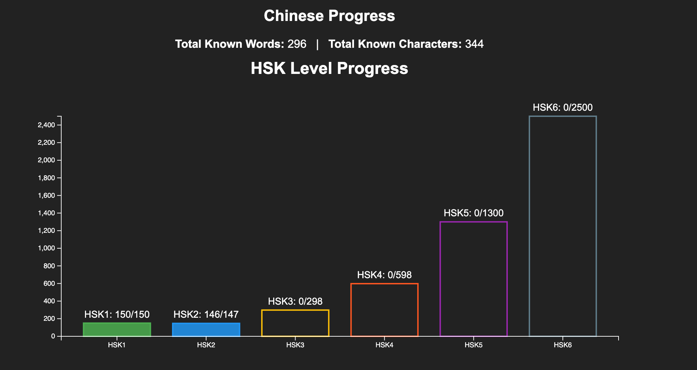
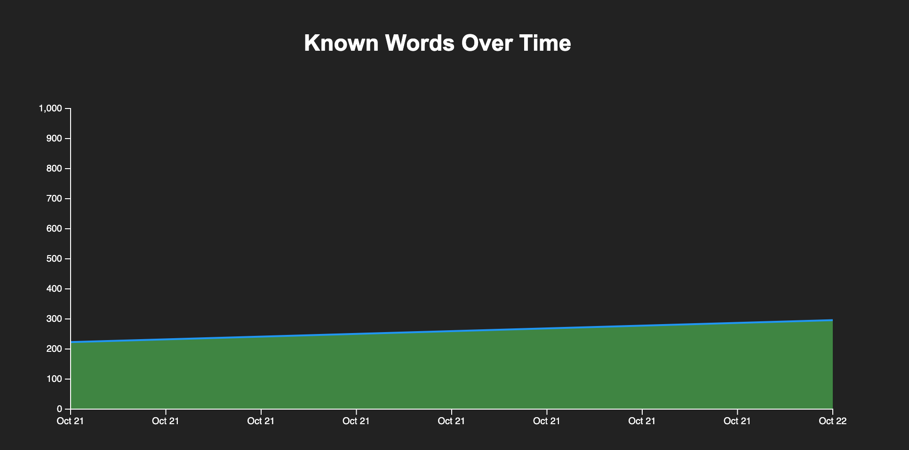

# Anki Learn Chinese Progress Extension

This add-on visualizes your Chinese learning progress in Anki, showing both vocabulary and character mastery using interactive charts directly in the deck browser and popups.

## Features
- **Chinese Progress Summary**: Displays total known words and characters at the top of the deck browser.
- **HSK Level Bar Chart**: Shows progress for each HSK level (total vs. known cards) with color-coded bars and tooltips.
- **Known Words Area Chart**: Visualizes growth of known words over time with a smooth area chart.
- **Popups**: Dedicated dialogs for each chart, accessible from the Tools menu.

## How It Works
- The add-on aggregates your card data, tags, and review history to compute stats.
- Charts are rendered using D3.js templates, with data injected dynamically from Python.
- All charts and stats appear at the bottom of the deck browser, and can be opened in popups for larger view.

## Example Output

### Deck Browser View

- The top section shows your total known words and characters.
- The HSK bar chart visualizes progress for each HSK level.
- The area chart shows your known words growth over time.

## Installation
1. Place the add-on folder in your Anki `addons21` directory.
2. Restart Anki.
3. Open the deck browser to see your progress charts.

## Menu Actions
- **Chinese Vocabulary Progress**: Opens a popup with the HSK bar chart.
- **Known Words Over Time**: Opens a popup with the area chart.

## Technical Details
- Python 3.9+, PyQt6, D3.js
- Uses Anki hooks (`deck_browser_will_render_content`) for HTML injection
- Data aggregation via custom models (`Card`, `Review`, `ProgressAggregator`)
- Robust template-based chart rendering

## References
- See `docs/feat/chinese-learn-progress/` for design and implementation details.

---
For questions or contributions, see the LICENSE and open an issue on GitHub.
